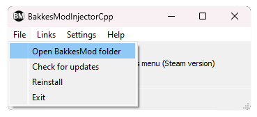
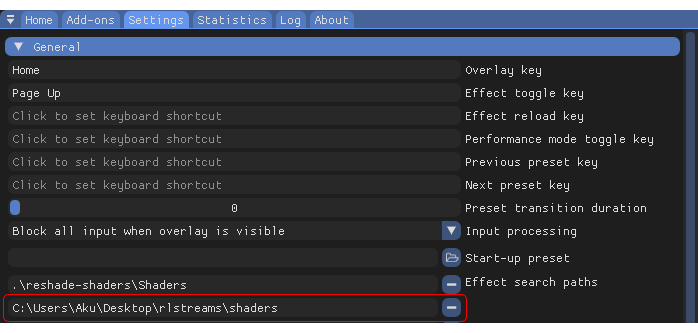
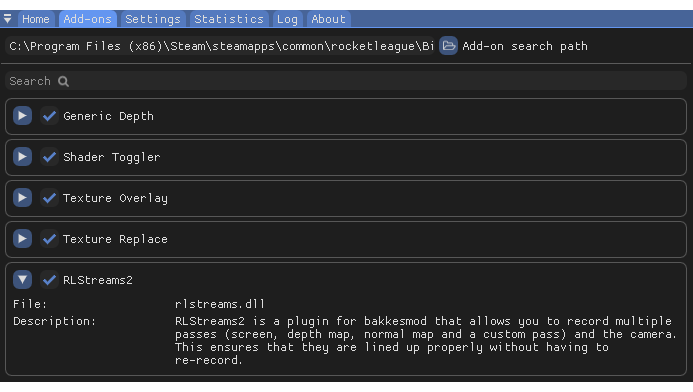
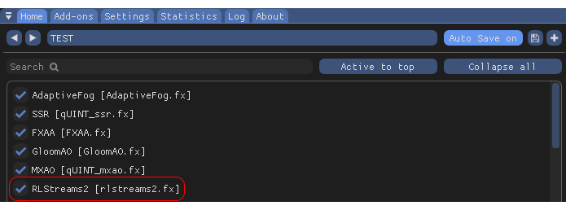
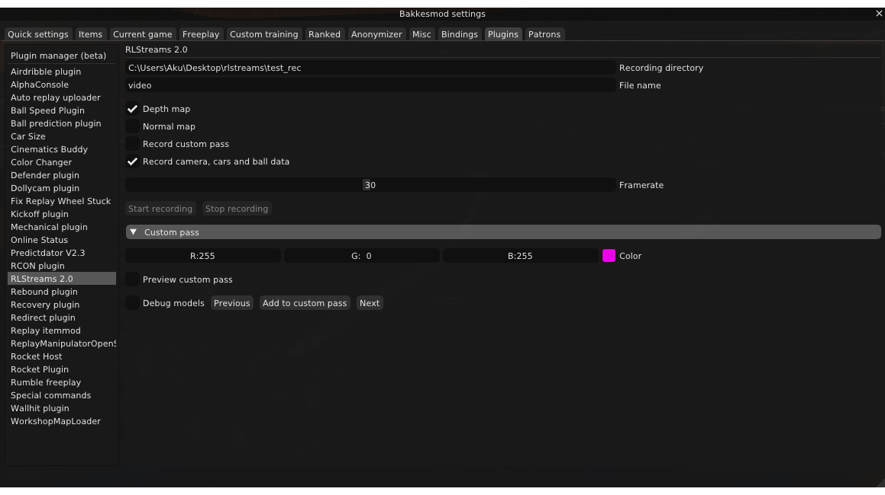
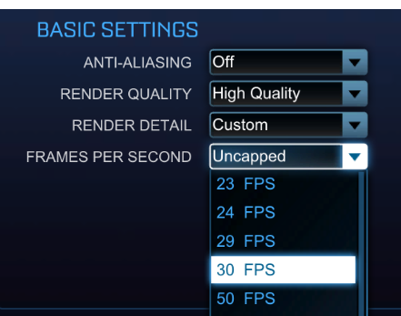
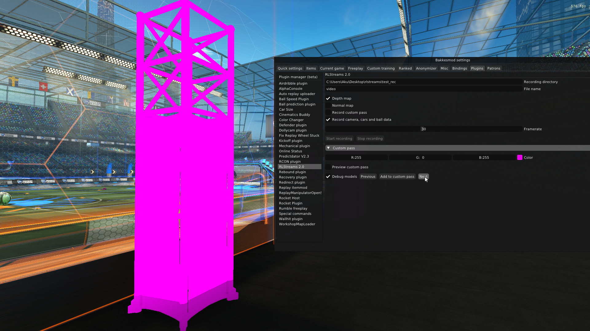

# RLStreams2

RLStreams2 is a plugin for bakkesmod that allows you to record multiple passes (screen, depth map, normal map and a custom pass) and the camera. This ensures that they are lined up properly without having to re-record.

## Requirements

- [ReShade 5.4+](https://reshade.me/) with full add-on support
- [BakkesMod](https://bakkesplugins.com/)
- `x264vfw` from [K-Lite Codec Pack (Mega)](https://codecguide.com/download_kl.htm)

## Installation

1. Download latest version from [Releases](https://github.com/nemuiidere/rlstreams2/releases).

2. Copy `rlstreams2.dll` to your bakkesmod `plugins` directory.

3. Add shader directory to ReShade, then reload shaders.

4. Make sure the addon is loaded in ReShade correctly.

## Usage

Add `RLStreams2` effect **at the end** of your preset. It's important that you put it at the end, so that it captures all of the previous effects.

Next, go to `Plugins` tab in bakkesmod, and configure the plugin for your needs.

- Recording directory is where all of the video files will be recorded to, as well as the file containing camera, ball and cars data.

- File name is self-explanatory too. `.avi` extension will be added to the video files, and `.txt` to the camera file.

- Framerate controls what framerate the recording will be, you need to make sure your in-game framerate matches is **while recording**, so it's the best to figure out what framerate you get while recording with uncapped framerate before locking it.

If you record custom pass the actual framerate will be divided by 2, because of how custom pass works. But you should make sure that this framerate matches the in-game framerate in that case, otherwise the video will be sped up/slowed down.
*I've figured that 30 works for me with depth map and normal map (if you choose more passes to record at once, it will obviously use more of your CPU so your framerate will be lower).*

## Custom pass

To add any in-game object to the custom pass, enable `Debug models` option. Then press next button until you find something that you want to include in the custom pass.

Then press `Add to custom pass` button. If you disable `Debug models` and enable `Preview custom pass` option, you should see the object that you selected. You can mark as many objects as you want, and you can change the color of them.

You can now disable preview and either record using RLStreams or keep the preview on and record with a different program (like OBS or ShadowPlay).

### Saving and loading custom passes

You can save and load custom passes using bakkesmod console:

- To save: `rlstreams_custom_pass_save NAME`
- To load: `exec rlstreams/NAME.cfg`

Since those passes are saved as bakkesmod configs, you can open them and edit them manually as well.
